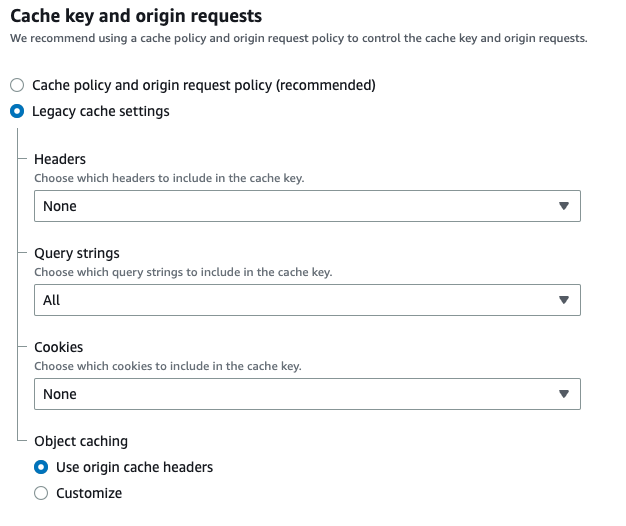

# arduino-weather-api
Node/Lambda based app which makes calls to National Weather service and simplifies responses to optimize data for Arduino processing


## National Weather Service data source

**API Docs**:

https://www.weather.gov/documentation/services-web-api

**Sample API Cal for NY**:
  
https://api.weather.gov/gridpoints/ALY/52,15/forecast

<hr />

## Lambda (API Gateway) endpoint

The code is deployed to Lambda (see below for deployment steps). An API Gateway is automatically created as well. Below is a sample url:

https://56gikm5okc.execute-api.us-east-1.amazonaws.com/production/simple-forecast?office=ALY&gridX=52&gridY=15

<hr />

## Cloudfront

The Arduino Ethernet Lib/Shield does not support TLS (HTTPS). As a workaround, Cloudfront is used as a proxy since it allows HTTP-only:
https://d2boyfgp9fovjg.cloudfront.net/production/simple-forecast?office=ALY&gridX=52&gridY=15

When setting behavior for this, we want to disable any caching since the application is only accessed periodically, and we always want the latest weather info.

To do this, `Cache-Control` is set to `no-store` in the Express app. Additionally, `eTags` are disabled. Cloudfront is set to use origin settings for caching.

One note: when setting "Behavior" for the Cloudfront CDN, use "Legacy Cache Settings" and set "Query strings" to `All`, otherwise query string params will not be passed through to the application:



<hr />

## Development

```
npm i
npm run dev
```

View in http://localhost:8000/simple-forecast?office=ALY&gridX=52&gridY=15

<hr />
## Deployment to Lambda

Ensure that aws-cli is installed along with your API key and secret

```
npm run deploy
```

<hr />

## Issues

When deployed, day 1 and day 2 are combined (at night). I assume this is a timezone issue as it works fine on localhost.

The Lambda function seems to always use UTC, which makes today tomorrow in the evening, resulting in a n incorrect index for the day.

To fix this, instead use the numeric year/month/day from the string instead of a date object.